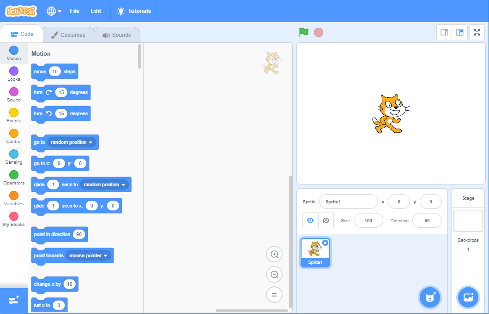

# How to use Scratch

## Overview

Several of the Scouts Digital Maker Badge activities are based on Scratch, a coding tool designed for young people. You can use Scratch to create art, games, stories, and animations.

Scratch is widely used in primary and secondary schools, so it’s very likely that many of your young people have created code with it before. Leaders can watch the Getting Started with Scratch video [rpf.io/scratch-get-started](http://rpf.io/scratch-get-started) to find out what Scratch is all about.

Scratch is a graphical programming language: instead of having to type out commands to create programs, you assemble colourful code **blocks**. Scratch programs involve creating code for **sprites**, which are visible objects that interact with each other in the coding environment, called the **stage**. 

This visible ‘acting out’ of the code makes it simple for learners to follow along with their program and understand what each code block does. And if there is a mistake (which is know as a bug) in the program, being able to see the behaviour of the sprites on the stage makes the debugging process much easier.

If you’re feeling uncertain about using Scratch, don’t worry. You don’t need to know a lot about coding: each activity is designed so that leaders can learn alongside young people. The only bit of preparation you need to do is to ensure that you can run Scratch-based activities at your venue, particularly if you don’t have internet access there. 

Below, you will find general information on using Scratch. If more preparation is needed for one of the Scratch-based Scouts Digital Maker Badge activities, it will be described on activity resource.

## Running Scratch: online vs offline

**If you have internet connectivity at your meeting place**, you can run Scratch online in a web browser on desktop computer, laptop or tablet.

Use the link given in the resource you’ll be working with to open the right Scratch starter project.

**If you don’t have internet connectivity at your meeting place**, you’ll need to do two things ahead of the meeting, somewhere you have internet access:

1. Download and install Scratch Desktop on the computer(s) you’ll be using. To do this, follow the instructions on the Scratch download page [rpf.io/scratch-off](http://rpf.io/scratch-off). Scratch Desktop can run on Windows PCs and Apple Macs, and is included in the default setup for Raspberry Pi computers.
2. Download the Scratch starter project file using the link in the activity.

When you’re ready to run the activity:

1. Open Scratch Desktop.
2. Open the Scratch project file you downloaded.

## Starter projects

Some activities use a Scratch starter project to help you get going. In the activity resource, there will be a link to the project:
+ To use the project online in a web browser, just click on the link.
+ To download it for offline use, follow the instructions in the section above.

## Try it out

To familiarise yourself with the activity, it’s a good idea to try the Scratch project out before running it with your section.
